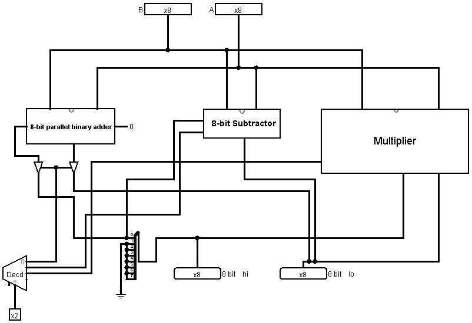

# CPIT210 Course Project
Introduction about your project, describe the problem, and your solution. Project truth tables, expressions, k-maps and any related task must included here. Also project documentation must included.

In this project students should work in groups of 3 to implement a fully functioning sequential circuit. This sequential circuit should work as a Buffer, a competition circuit, or 4-way light circuit depending on the student's choice. The idea of the three projects will be explained in the lab. To design the circuit, Logisim should be used. Students should submit their software implementation and the report here. 

## Group Members
[comment]: <> (each group memeber should write his first, middle and last name with link to his GitHub account)
- [Baraa Majed Algomlas](https://github.com/Techiewicky)
- [Faisal Alzahrani](https://github.com/fsalzhrane)
- [Salman Balahwal](https://github.com/SalmanBalahwal)

[comment]: <> (Students should include the contribution percentage of each group member.)
[comment]: <> (Example:)
### Contribution:
- Baraa Majed Algomlas 30%
- Faisal Alzahrani 40%
- Salman Balahwal 30%

## Calculator Project:

.
#### Problem Statement:

.
#### Half Adder:

.
#### Full Adder using combined Half-Adder:

.
#### 8-bit parallel binary Adder:

.
#### 8-bit parallel binary Subtractor:

.
#### 8-bit Multiplier:

.
#### Multiplier Helper:

.
#### Final Circuit Design:

.
## The Full Project Image

