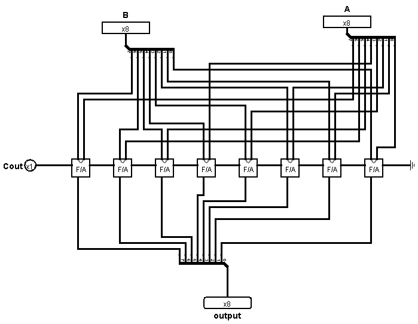
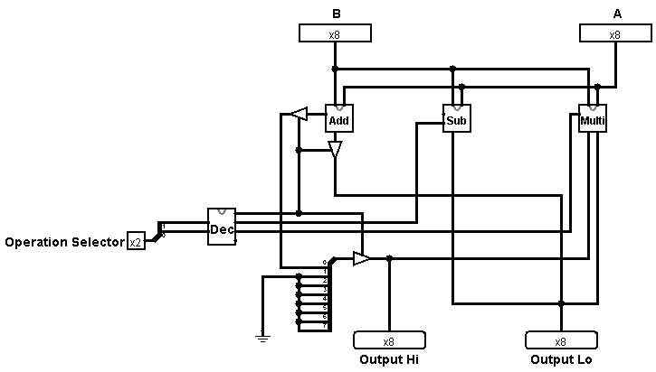

# CPIT210 Course Project
Introduction about your project, describe the problem, and your solution. Project truth tables, expressions, k-maps and any related task must included here. Also project documentation must included.

In this project students should work in groups of 3 to implement a fully functioning sequential circuit. This sequential circuit should work as a Buffer, a competition circuit, or 4-way light circuit depending on the student's choice. The idea of the three projects will be explained in the lab. To design the circuit, Logisim should be used. Students should submit their software implementation and the report here. 

## Group Members
[comment]: <> (each group memeber should write his first, middle and last name with link to his GitHub account)
- [Waleed Awaddh Alsafari](https://github.com/WaleedAlsafari)
- [Ahmed Abdulrhman Alamoudi](https://github.com/AhmedAbdulrahmanAlamoudi)
- [Ahmed Mohamed Alamoudi](https://github.com/Ahmedyz123)

[comment]: <> (Students should include the contribution percentage of each group member.)
[comment]: <> (Example:)
### Contribution:
- Waleed 33.34%
- Ahmed Abdulrhman 33.33%
- Ahmed Mohamd 33.33%

## Calculator
#### Problem Statement
This circuit is used to perform three arthimatic operations Addition, Subtraction, and Multiplication of two numbers with 8 bits. Students required to build required components from the basic logic gates (AND, OR, XOR, NOT gates). Implementation should contains design of half adder, full adder, and 8 bits parallel binary adder. Subtraction and Multiplier should implemented using full adder as described in following diagrams. You are not allow to use pre-designed Adder, Subtractor, and Multiplier, you mush build them from scratch.

## Explanation

## Addition:  
 In the beginning we Create a simple circle It is called Half adder Then we create a Full adder.

#### Half Adder
This circuit has two inputs, value of A and value of B, and it has two outputs, the sum and the carry. For example, if we add 1 and 1 together, then we get 10 in binary. The 0 would be the sum and 1 would be the carry. Now that we can add two 1-bit numbers together, let’s build a full adder so that we can do more complex addition.

#### Full adder 
The full adder extends on the half adder by adding a carry bit input. This means that we can combined these together and add multi-bit numbers together. the full adder is constructed from two half adders.
basically, what this circuit accomplishes is adding three 1-bit numbers together. For example, 1 + 1 + 1 = 11 in binary.

Now that we have a full adder, we can add multi-bit numbers together. We want to add two numbers that contain 8 bits, so we need eight full adders chained together, each square represents one full adder. The carry bit output of the adder on the right feeds into the carry bit input of the adder on the left.

through this circuit, we can add two 8-bit numbers together. Ex: adding 00000011 (number A) and 00001010 (number B) together.  As you can see from the output bits, the result is 00001101.

## Multiplier
In the multiplier circuit, we divide the problem into smaller one.

#### 8 by 1 bit multiplier
At this circuit, we multiply an 8 bits number (Say for example A) by 1 bit number (Say for example B). ‘A’ value could be any number between 0 and 255 but ‘B’ value either 0 or 1. So in general, any value that is multiplied by 1 will give the same value. On the other hand, any value that is multiplied by 0 will give 0. So, if we think how to solve it on the logic gates we will probably think of AND gate! 

If one of the two inputs in AND gate is 0 the result will be, but if the two input is 1 it will give 1 immediately. In our case we have 8 bit number so we need 8 AND gates to implement our circuit. Each of AND gate will be connected to ‘B’ value because it’s 8 by 1 bit multiplication. If ‘B’ value is 0 it will give 0 to each AND output, but if it’s 1 in this case it will depend on each bit of ‘A’ value. For example, if ‘A’ is 00000011 and ‘B’ is 1, the first 2 and gates from left will five an output 1 and other is 0 so the result will be 00000011.

#### 8 by 8 bit multiplier 
Here we want to multiply 8 by 8 bits which means that ‘B’ value will be 8-bits. So, we need eight circuits of ‘8 by 1 bit multiplier’.  Each bit from ‘B’ value will go to the right place of ‘8 by 1 multiplier’. Also, we need seven ‘8-bit parallel binary adder’ so each tow output of the ‘8 by 1 multiplier’ will go to ‘8-bit F/A’ to do addition operation. Each of the ‘8-bit F/A’ output’s first bit will go immediately to the Lo output respectively first output’s first bit. The other output’s bits from ‘8-bit F/A’ Will go to next ‘8-bit F/A’ until they reach the last ‘8-bit F/A’ and go to Hi output. 

The Lo output is used for the first 8-bit output and the Hi output used for the next 8-bit output. So, if we combined them, it will give us 16 bits output. For example, if we multiply the  11111111 by 00000010 it will give us 00000001 11111110. The purpose of using hi is because that in some multiplication process of 8 by 8 bits , the output will be more than 8-bit. So, if we don’t use the 8-bit hi output, it will give us an overflow. Last thing, we made an Enable button for the multiplier circuit to turn it on/off and to use it for the decoder latter. 

##Decoder
 There is a problem when we put two inputs A and B with 8 bits the circuits will perform all operations add, subtract and multiply. so we need a decoder that will chose which output from operations will goes to outputs hi and lo on the external circuit by controlling them by Enable input. The decoder circuit designed to choose output 1(add operator) if the value of two inputs is 00, chose output 2(subtract operator) if the value of two inputs is 01, chose output 3(multiplication operator) if the value of two inputs is 10, and chose output 4 if the value of two inputs is 11 which will do nothing on the circuits.

##The final Calculator circuit
At the end, we combined all the circuit that we made together for designing the calculator circuit. First thing, we connect the input ‘A’ and ‘B’ to each of the adder, subtractor and multiplier. Next thing, we connect each of the arithmetic circuit’s output to the Lo and Hi output except the subtractor circuit which we only connected to the Lo output cause it’s impossible to have more than 8 bits result of subtractor operation. Plus we don’t need the carry out of the subtractor cause like we said there will not be any result more than 8-bits. 
Another thing is that we connect the Carry out of the Adder to a splitter before connected it to the Hi output, and only connect the first bit to the Hi output, because the maximum result that that will get from the adder is 00000001 11111110. The other bits is connected to a ground (Indicate input  with value 0). Lastly, we built Decoder to choose the operation that we want to perform.

## Grading Factors
Each student's grade will defer from his group-mate 
- content and organization
- stating the problem need to be solved
- explanation of each component used
- explanation of whole circuit/integration of component
- how often you update/participate/contribute in group repository

## Deadline
Monday 29 / 7 / 1444 H, *20 Feb. 2023*

## Logic Expression
Include exported image from Logisim of your project here. *(Screenshot is not accepted!)*

