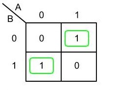
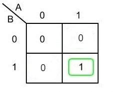

# Calculator Project:
## Introduction:
In This Project we will be covering how to make an 8-Bit Calculator in Logisim capable of functioning all the standard arithmetic operations: addition, subtraction, multiplication from the scratch by using the basic logic gates (AND, OR, XOR, NOT gates, Buffer).

## Group Members

- [Baraa Majed Algomlas](https://github.com/Techiewicky)
- [Faisal Alzahrani](https://github.com/fsalzhrane)
- [Salman Balahwal](https://github.com/SalmanBalahwal)

### Contribution:

- Salman Balahwal 30%

Addition(half Adder, Full Adder, 8-Bit Adder).
- Baraa Majed Algomlas 30%

 Subtraction(8-Bit Parallel Binary Subtractor), Multiplication(Multiplier Helper).
- Faisal Alzahrani 40%

Multiplication(8-Bit Multiplier), Final Circuit.

## Addition

### Half Adder:
Why do we use Half Adder?
- Half Adder is used to add two single-digit binary numbers.

  

Half Adder has two inputs, sum and carry. The Half Adder is built by using the XOR gate and the And gate. It has two outputs the sum and carry. For example, if both inputs are 1 the output in sum will be 0 and the carry will be 1.

#### Components: 
- XOR gate
- AND gate

### Half Adder Circuit:

  

### Full Adder using combined Half-Adder:
Full Adder has three inputs, which are value A, value B, and Cin. Also, it has two outputs they are the sum and carry. However, in Full Adder, we use two Half Adder and one OR gate. 

As you can see in the truth table if all inputs are 0. The sum will be 0 and the cout will be 0.
- For example:
A=0 
B=0
Cin=0
Sum=0 
Cout=0

In the truth table if one of the inputs is 1. The sum will be 1 and cout will be 0.
- For example:
A=1
B=0
Cin=0
Sum=1
Cout=0

If two inputs are 1 and one input is 0. The output will be sum 0 and Cout 1.
- For example:
A=1
B=1
Cin=0
Sum=0
Cout=1

Finally, if all inputs are 1. The sum will be 1 and the Cout will be 1.
- For example:
A=1
B=1
Cin=1
Sum=1
Cout=1

#### Components: 
- Half Adder 
- OR gate

### Full Adder Circuit:

  

### 8-bit parallel binary Adder:
The main purpose of 8-bit binary Adder is to add two eight bits binary with each other. I use A and B as the eight bits and it is connected with a splitter. The reason for the splitter is to take one input and return eight outputs. Also, there is an eight Full Adder each Full Adder is connected to one A and one B, and it’s also connected by Cin. In the output, there will be eight sum and one Cout. The sum will be connected to a splitter. The purpose of the splitter is to take input of eight sum and return one sum.  For example, if A=00000110 and B=00000101 sum=00001011.

#### Components: 
- Full Adder
- Splitter

## Subtraction
### 8-bit parallel binary Subtractor:

Subtraction can be represented as adding a positive number to a negative number,

for example: 4–2 = 4 + (-2) 

the real question is, how do we represent a negative number in binary?

One of the most efficient ways is to use 2’s complement which basically is to invert the added value and add 1 to the total.  
The way we will represent that in the Subtraction component we re-used the 8-bit adder the only difference is that the circuit inverts the B inputs and sets the carry input to 1.

As you can see, we added an enable button to control the circuit and to add 1 to the carry.

#### Components: 
- 8-Bit Adder
- Not Gate
- Buffer

### Subtractor Circuit:

## Multiplication
### Multiplier Helper:

Firstly, when we want to implement the 8-Bit Multiplication Circuit we will use a lot of space, and also, we can’t just multiply 8x8 once, So In order to do it we need to understand how does Binary multiplication works.

In the case of a binary operation, we deal with only two digits, 0 and 1.

the only possible multiplication operations scenarios are:

- 0 × 0 = 0

- 0 × 1 = 0

- 1 × 0 = 0

- 1 × 1 = 1

If we take close look, we will notice that we can use an AND gate for this, 
but we can’t just multiply 8x8 we need to take it apart.

In order to do that we will use the multiplier helper.

The purpose of the multiplier helper is to multiply one bit by 8-Bits partially Then add them one by one using the 8-bit adder.
Let’s say we have A8xB8:

- First we will calculate A8xB1 by multiplier helper

- Then we will calculate A8xB2 by multiplier helper 

- Then we add them together using 8-bit adder and so on until we reach A8xB8 … 

For example: 

A = 10110110

B = 10010110

A8xB1 = 10110110 x 0 = 00000000

because 0 AND 1 = 0

#### Components: 
- AND Gate
- Splitter
### Multiplier Helper Circuit:

### 8-Bit Multiplier:

After finishing the multiplier helper our main problem is that the multiplier helper does 8 by 1 bit only so the main goal here is to expand this concept to a full 8
by 8 bit multiplication circuit allowing us to multiply two 8 bit binary numbers

First we used multiplier helpers and connected them with the inputs from A and B the idea here is to multiply the selected bit in B with all bits in A.

ex: A=11101010 B=1  

equal: 11101010

Then we used 8-bit parallel binary adder to take the outputs that are coming from 2 different multiplier helper to apply addition on the multiplication outputs and
proceed to do so with all the rest A*bi outputs.

example of 4*4 bit:

then we took 1 bit from every binary adder output to connect them in the end with the (lo) output and the rest of the last binary adder bits went to the (hi) output

So we continued this until we ended up using 8 multiplier helpers and 7 binary adders until we reached 8 input from B with 8 output on (lo) and (hi) to show all the
answer bits without an overflow 

At the end we needed an enable button for the circuit to choose either to show the output or not.

#### Components:
- Multiplier Helper (A*bi)
- 8-bit parallel binary Adder

## Final Circuit:

Now after we reached this far all we need to do is to gather all the Addition , Subtraction Multiplication Circuits in one place to apply our calculator, now we simply
connect the three operations with A and B inputs and with the lo hi outputs beside the subtraction only first part of the output and in the end we don’t want all the 
operations to work at the same time so we added a Decoder to distinguish each circuit and operate one arithmetic operation at a time by selecting (00) for Addition and
(01) for Subtraction and finally (10) for Multiplication and we connect enable from Multiplier and subtraction and Cout from addition to the decoder 
And now we have a full functioning calculator

### Final Circuit Design:

